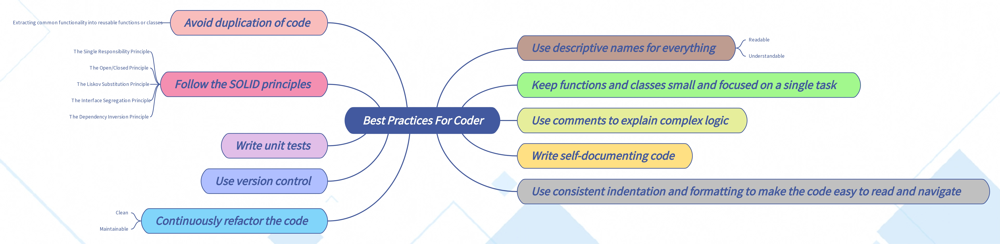

# Best practices for coder

<!--more-->
**Best practices for coder**

1. Use **descriptive names** for everything to make code
    1. **Readable**
    1. **Understandable**

1. Keep functions and classes **small** and **focused** on a **single task**

1. Use comments to **explain complex logic**

1. Write **self-documenting** code

1. Use consistent indentation and formatting to make the code **easy to read and navigate**

1. Avoid **duplication** of code
    1. Extracting common functionality into **reusable** functions or classes

1. Follow the **SOLID principles**
    1. The Single Responsibility Principle
    1. The Open/Closed Principle
    1. The Liskov Substitution Principle
    1. The Interface Segregation Principle
    1. The Dependency Inversion Principle

1. Write **unit tests**

1. Use **version control**

1. **Continuously refactor** the code to improve
    1. Clean
    1. Maintainable
