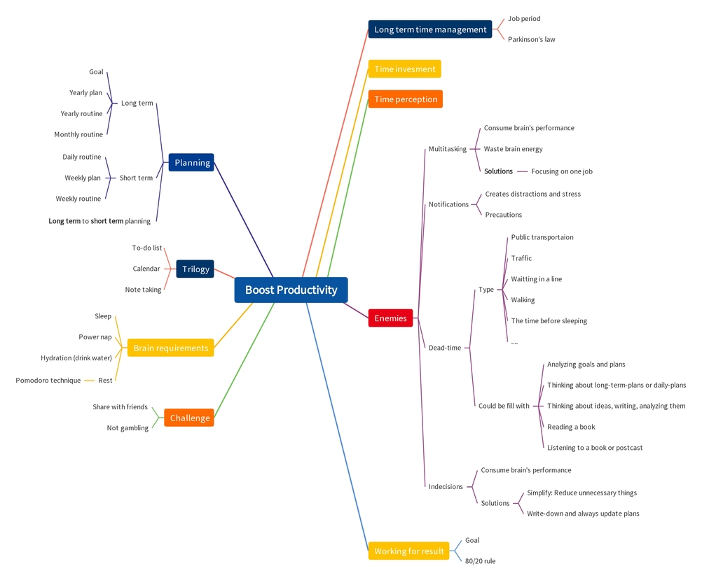

# Boost Your Work Productivity: A Simple Guide

# Boost Your Work Productivity: A Simple Guide

In today's fast-paced world, improving your productivity is crucial for achieving success and maintaining a healthy work-life balance. By working more efficiently, you can get more done in less time, reduce stress, and you have more time for activities you enjoy. Here’s a simple guide to help you boost your work productivity.

<!--more-->

## Set Deadlines
- Deadlines help keep you focused. They give you a clear end date for your tasks. Make sure every task has one.
- Parkinson’s Law says work expands to fill the time available. Set **tight deadlines** to **avoid procrastination**. Finish your tasks before the deadline to stay ahead.

## Productivity Enemies
- **Multitasking**: Doing many things at once wastes brain energy so reduces efficiency. You should **focus** on one task at a time.
- **Notifications**: Alerts from phones and computers distract you. **Turn them off** if you can while working.
- **Dead Time**: You cannot avoid dead-time like traffic, waiting for something, the time before sleep... Try to fill them with suitable tasks.
- **Procrastination**: Delay is a productivity killer. Start tasks right away and break them into smaller steps.
- **Indecision**: Overthinking tasks reduces productivity. Write down and always update your plan. Remove unnecessary tasks. 

## 80/20 Rule
- The 80/20 rule says 80% of results come from 20% of efforts. Focus on the tasks that give the most results.

## Planning
- **Long-Term**: Create yearly and monthly plans. Set routines for these periods.
- **Short-Term**: Make weekly and daily plans. Follow daily routines to stay on track.

## Use Technology
- **To-Do Lists**: Keep track of tasks.
- **Calendars**: Schedule your work and deadlines.

## Set Challenges
- Make goals public. Set rewards and penalties. Ensure they are fair and motivating, not like gambling.

\
By following these tips, you can increase your productivity and get more done efficiently.
