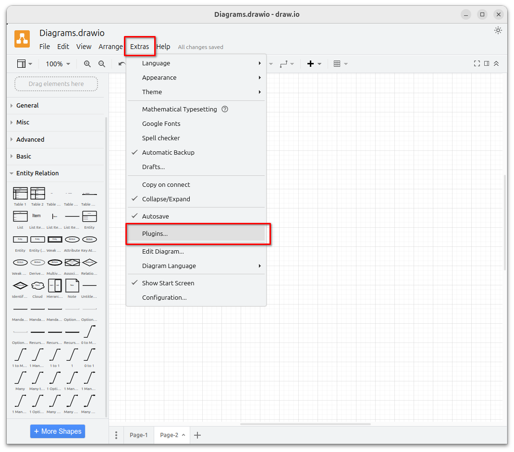
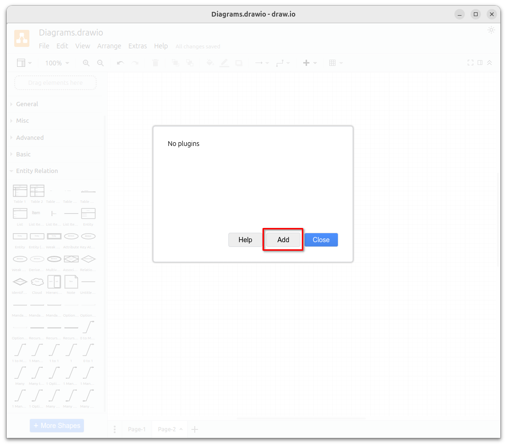
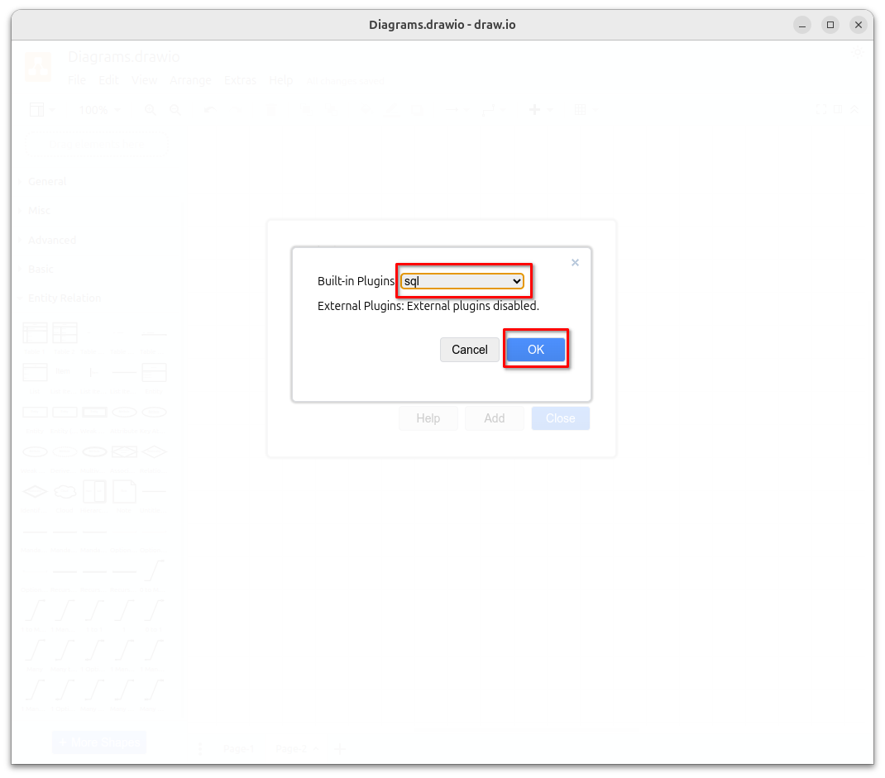
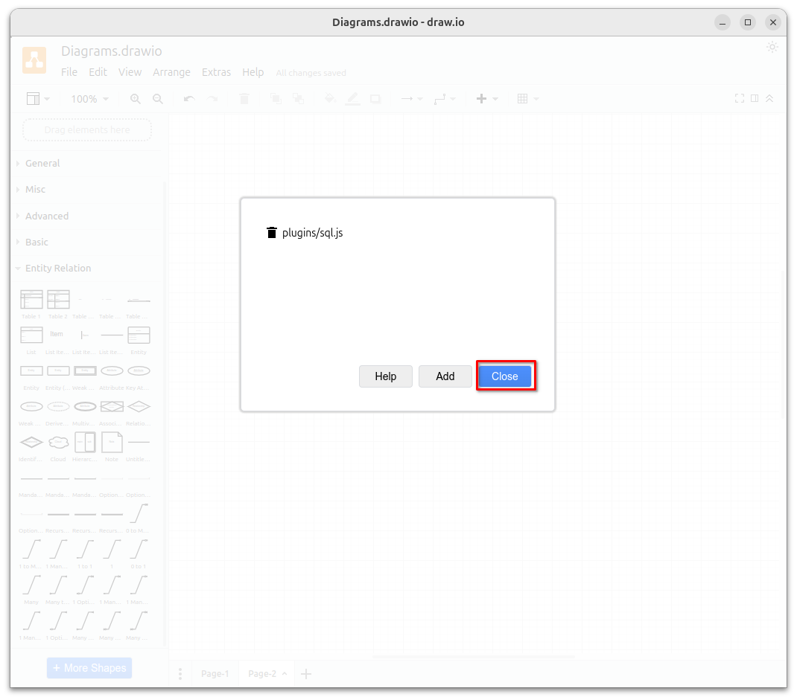
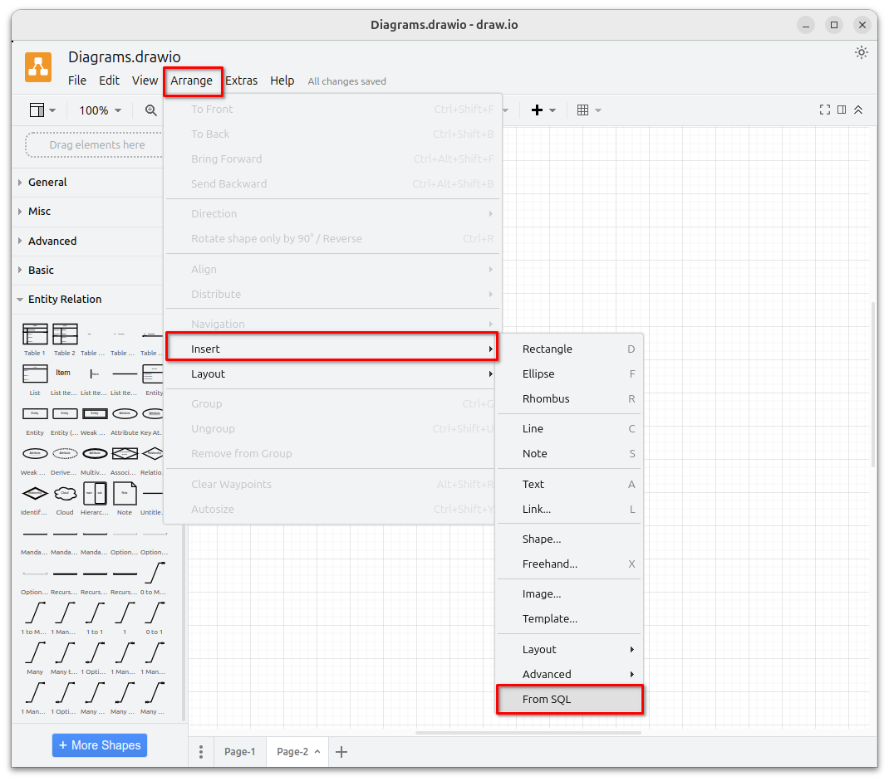
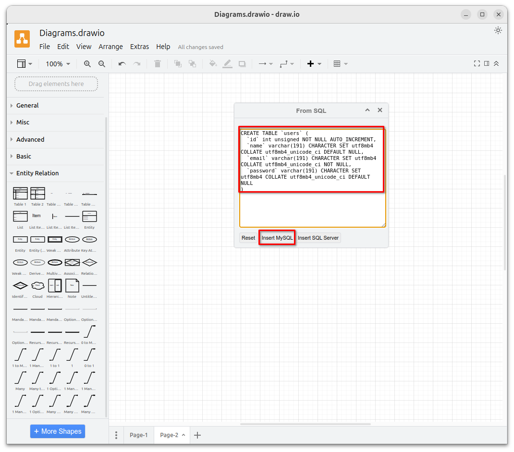
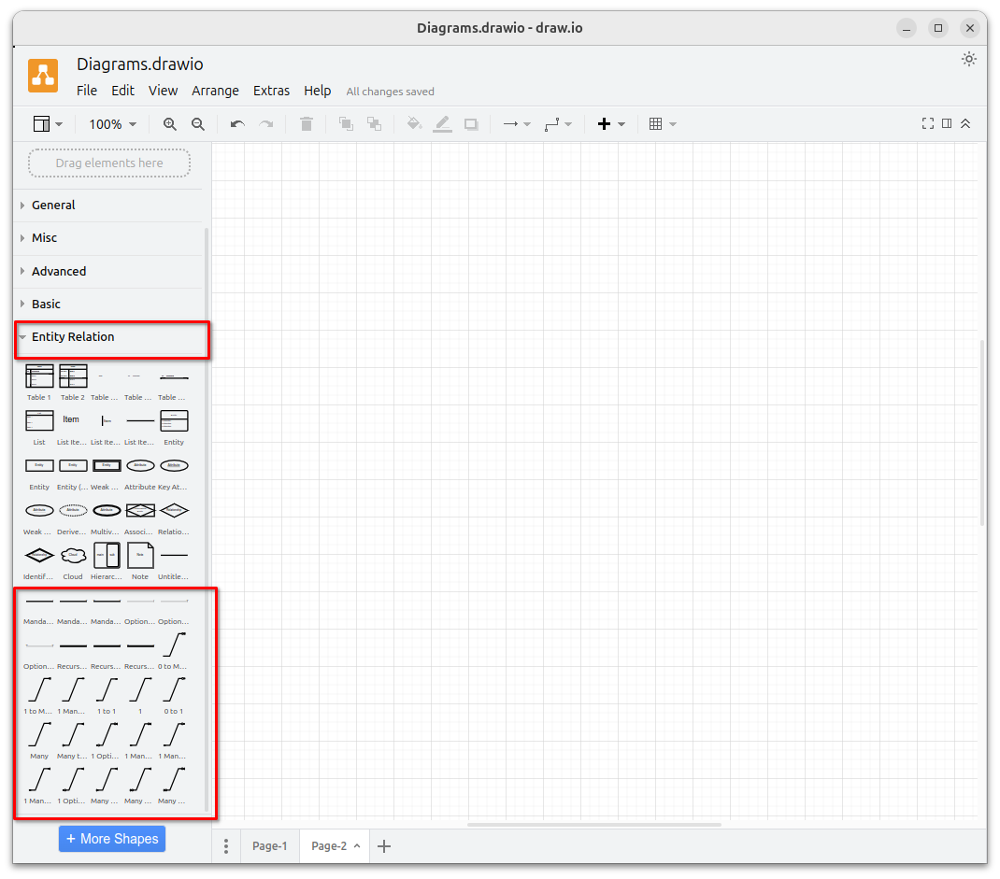

# Create an Entity Relationship Diagram with draw.io V24.7.5

# Introducing the New "Create an Entity Relationship Diagram" Feature in Draw.io Version 24.7.5

**Draw.io** has just added a new feature: creating an Entity Relationship Diagram (ERD). This update makes it easier to design and visualize database structures.

<!--more-->

## How to Install the Plugin:
1. Go to the **Extras** menu and Click on **Plugins**.
2. Click on  **Add**.
3. Choose **SQL** and click **OK**.
4. Close dialog, restart your browser or app to use this plugin.

## How to Create an Entity:
1. Go to **Arrange**. Click on **Insert**. Select **From SQL**.
2. Paste your SQL script into the new input box. Click **Insert MySQL** or **Insert SQL Server**.

## Adding Relationships:
- Choose **Entity Relation** shape to draw relationships between entities.\

\
This new feature helps streamline the process of creating ER diagrams directly within Draw.io. Enjoy the enhanced functionality!
