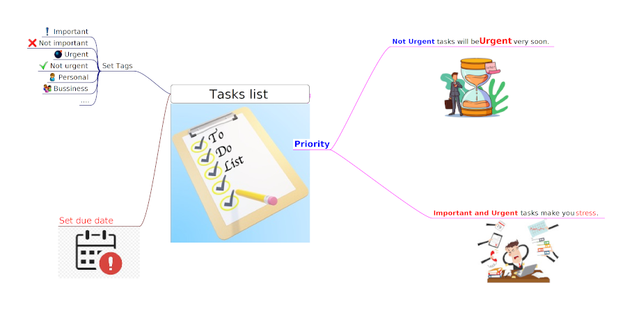

# How to manage your tasks list?

Hello, it's me again. Today, I'd like to share with you how I manage my tasks effectively.

When I receive a new task, the first thing I do is assign one or more tags to it. This helps me to categorize and prioritize my tasks based on their level of importance or urgency. Next, I set a due date for the task and add it to my list. It might seem simple, but this method has proven to be very effective for me.
<!--more-->

However, it's important to note that tasks that are not urgent can quickly become urgent if they're not handled promptly. That's why it's crucial to carefully prioritize your non-urgent tasks and ensure they don't become urgent tasks later on. Additionally, when dealing with important and urgent tasks, it's essential to take breaks and avoid getting burnt out.

Overall, by following these simple steps, I'm able to stay organized and handle my tasks efficiently. Remember, prioritizing and strategizing are key to managing your workload effectively.

