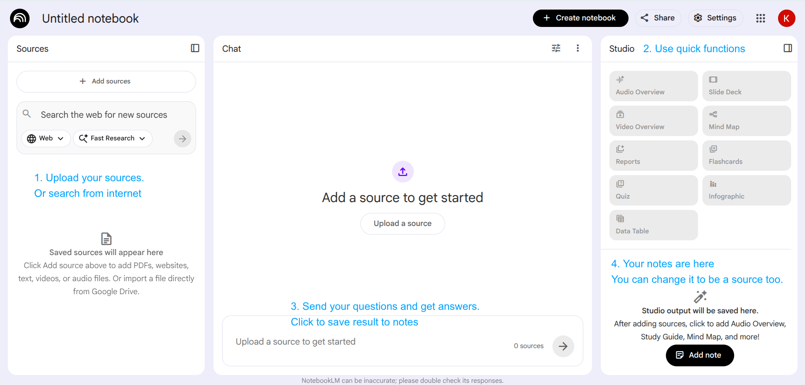

# How to Use NotebookLM: A Practical Guide for Research and Learning (2026)

If you spend hours **reading documents**, **summarizing notes**, or trying to **connect ideas** across multiple sources, **NotebookLM** can automate most of that work.

In this guide, you’ll learn exactly how to use NotebookLM step-by-step, along with practical use cases and tips to get better results.

---

## What is NotebookLM?

NotebookLM is an AI-powered **research assistant** developed by Google that works with **your own data**.

Instead of generating generic answers, it helps you:

* Analyze documents (PDFs, Google Docs, websites)
* Summarize complex information
* Extract insights from multiple sources
* Generate study guides, notes, and even audio or video summaries
<!--more-->
---

## Why Use NotebookLM?

Here are some real benefits of using NotebookLM:

* **Save time on reading**: Instantly summarize long documents
* **Understand faster**: Ask questions and get contextual answers
* **Connect ideas**: Combine insights across multiple sources
* **Boost productivity**: Turn raw information into structured knowledge

---

## How to Use NotebookLM (Step-by-Step)

Follow these steps to get started quickly:

### Step 1: Create a Notebook

Go to the [NotebookLM website](https://notebooklm.google.com/) and create a new notebook for your project.

Each notebook acts as a workspace where your sources and AI interactions live.

---

### Step 2: Upload Your Sources

Add your materials, such as:

* PDF files
* Google Docs
* Web links
* Or NotebookLM will search by topic from the internet

💡 Tip: Upload multiple sources to get better insights.

---

### Step 3: Ask Questions

Once your sources are ready, start asking questions like:

* “Summarize this document”
* “What are the key ideas?”
* “Compare these two sources”

NotebookLM will answer based only on your uploaded content. You can save the answer to notes.

---

### Step 4: Generate Summaries and Insights

You can ask it to:

* Create summaries
* Extract key points
* Generate structured notes
* Build study guides

💡 Tip: You can save the answer as a note inside your notebook.

💡 Tip: You can click to button in studio area to generate study materials like audio overview, video overview, slide deck, mindmap, flashcards, quiz, infographic... (as a note) quickly

💡 Tip: You can convert note to be a source to enrich your sources

---

### Step 5: Orginize your notes

This allows you to:

* Keep important insights for later
* Organize useful answers into structured notes
* Build a knowledge base directly from your conversations

💡 Tip: Use this feature to collect key ideas while researching, then refine them into summaries or final content.

---

## Real Use Cases

Here’s how different people use NotebookLM effectively:

### For Developers

* Analyze technical documentation
* Summarize APIs or specs
* Understand complex systems faster

### For Students

* Turn lecture notes into study guides
* Summarize textbooks
* Prepare for exams efficiently

### For Content Creators

* Research topics from multiple sources
* Extract key insights for articles
* Organize ideas into structured content

---

## Tips to Use NotebookLM Effectively

To get the best results:

* **Upload multiple sources** instead of just one
* **Ask specific questions** (avoid vague prompts)
* **Compare documents** to uncover deeper insights
* **Iterate your queries** to refine answers

---

## Limitations

NotebookLM is powerful, but keep these in mind:

* It depends heavily on the quality of your input
* It does not fetch real-time external data
* Results may vary depending on how you ask questions

---

## FAQ

### Is NotebookLM free?

It may offer free access with limitations depending on availability and region.

---

### What can NotebookLM do?

It can summarize, analyze, and generate insights from your own documents.

---

### Is NotebookLM better than ChatGPT?

NotebookLM is better for **document-based research**, while ChatGPT is more general-purpose.

---

## Conclusion

NotebookLM is a powerful tool for turning raw information into actionable insights.

If you regularly work with documents, research materials, or large amounts of data, learning how to use NotebookLM effectively can significantly improve your productivity.

