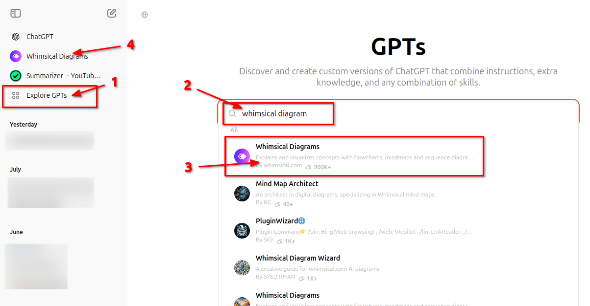
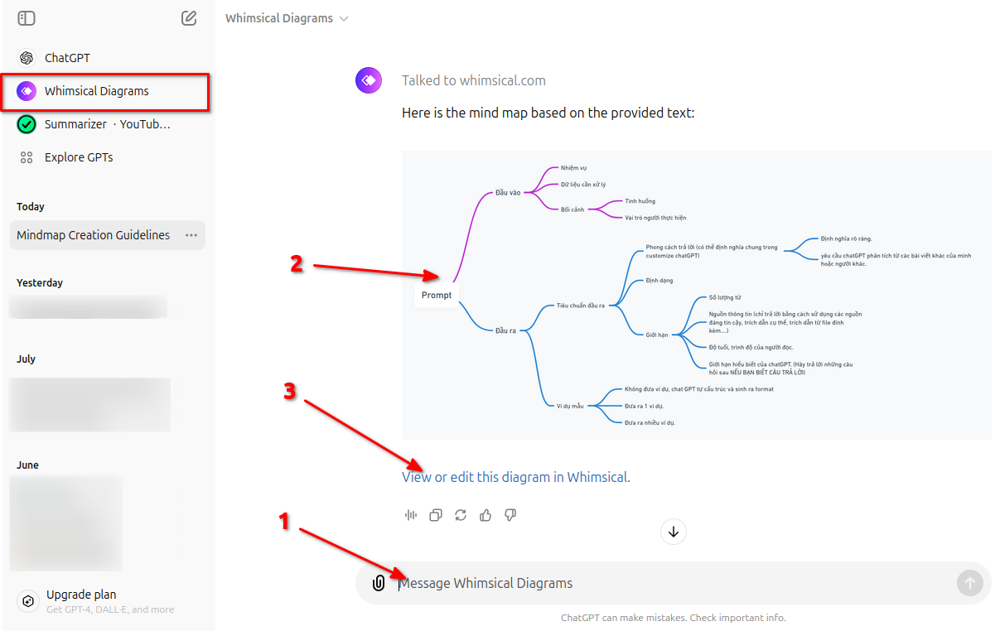

# Quick Guide to Using Whimsical Diagrams with ChatGPT

\
Making **mind-maps** and **diagrams** helps organize your ideas and projects. This guide will show you how to use **Whimsical Diagrams** with **ChatGPT**. We will cover everything from setting it up, saving your work, export to picture to share with other people. Just follow these easy steps to use these helpful tools.

<!--more-->

## Introduction to ChatGPT's Explore GPTs Feature

ChatGPT's **Explore GPTs** feature allows users to discover and use different tools and applications integrated with ChatGPT. This feature can help you enhance your productivity and creativity by using various specialized GPTs. One such tool is **Whimsical Diagrams**, which is great for creating **mind-maps** and **diagrams**.

## How to Find and Install Whimsical Diagrams

1. **Open ChatGPT**: Start by opening the **ChatGPT** app or website.
2. **Navigate to Explore GPTs**: Look for the **Explore GPTs** button or menu item in the interface.
3. **Search for Whimsical Diagrams**: Use the search bar to find **Whimsical Diagrams**.
4. **Install**: Click on the Whimsical Diagrams tool and follow the instructions to install or activate it.

## How to Request Whimsical Diagrams to Create a Mind Map or Diagram

1. **Start a New Chat**: Open a new chat with ChatGPT.
2. **Make a Request**: Type in a request like, "Create a mind map for this description text using Whimsical Diagrams."
3. **Specify Details**: Provide any specific details or structure you want for the mind map or diagram.
4. **Generate**: ChatGPT will use Whimsical Diagrams to generate the requested mind map or diagram.
\
\

## How to Refine Your Mind Map

1. **Review the Diagram**: Look at the mind map or diagram generated by Whimsical.
2. **Provide Feedback**: If you need changes, describe what you want adjusted. For example, "Add more branches for ...." or "Change the color for branch ...."
3. **Update**: ChatGPT will adjust the mind map or diagram based on your feedback.

## How to Edit and Export Your Mind Map on Whimsical

1. **Access Whimsical**: Click on the link or open the Whimsical app where your mind map or diagram is stored.
2. **Edit**: Use Whimsical's tools to make any further changes to your diagram. You can add, remove, or modify elements as needed.
3. **Export**: Once you are satisfied with your edits, export the mind-maps, save to your device and share with other people.
\
\
With these steps, you can effectively use **Whimsical Diagrams** in **ChatGPT** to create and refine mind maps and diagrams for any project or idea.

