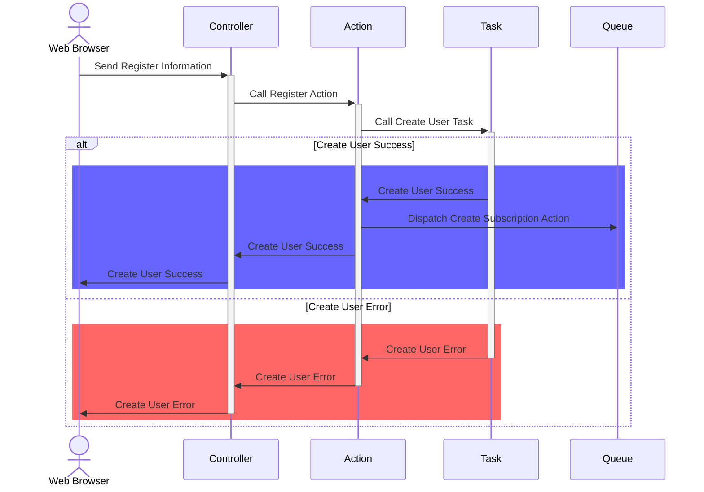
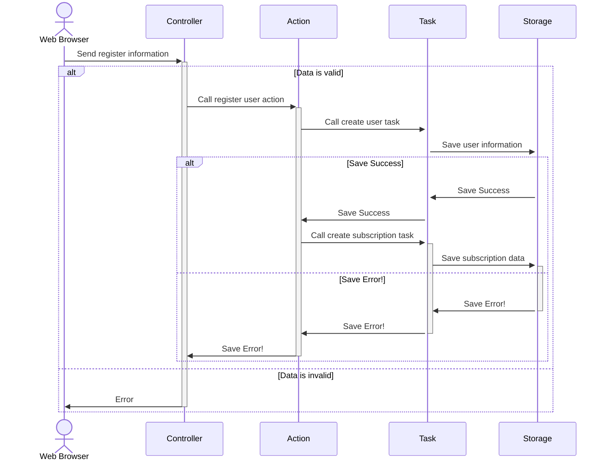
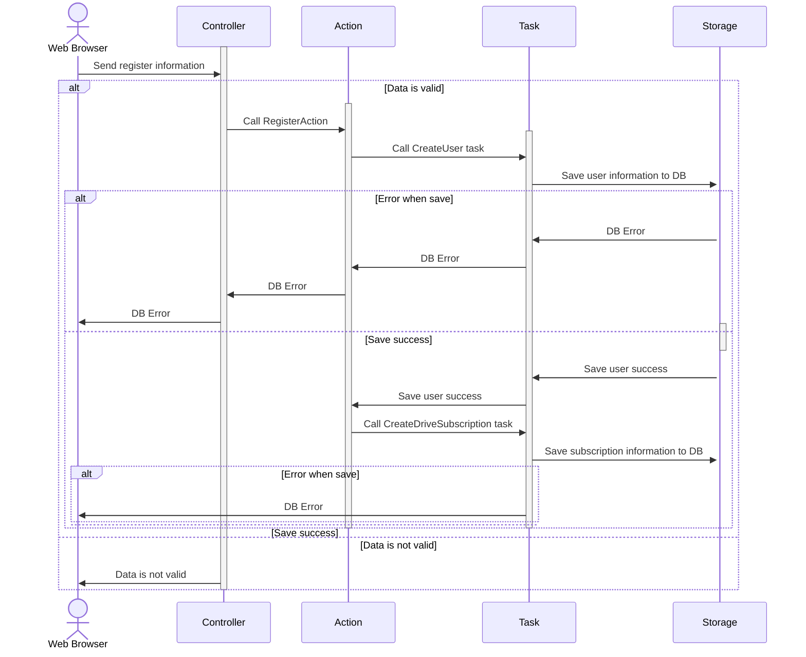

# User register

```mermaid
sequenceDiagram
    actor W as Web Browser
    participant C as Controller
    participant A as Action
    participant T as Task
    participant Q as Queue

    W->>+C: Send Register Information
    C->>+A: Call Register Action
    A->>+T: Call Create User Task
    alt Create User Success 
        rect rgba(0, 0, 255, .6)
            T->>A: Create User Success
            A->>Q: Dispatch Create Subscription Action
            A->>C: Create User Success
            C->>W: Create User Success
        end
    else Create User Error
        rect rgba(255, 0, 0, .6)
            T->>-A: Create User Error
            A->>-C: Create User Error
            C->>-W: Create User Error
        end
    end    
```

```mermaid
sequenceDiagram
    actor web as Web Browser
    participant controller as Controller
    participant action as Action
    participant task as Task
    participant db as Storage
    
    web->>+controller: Send register information
    alt Data is valid
        controller->>+action: Call register user action
        action->>+task: Call create user task
        task->>+db: Save user information
        alt Save Success
            db->>task: Save Success
            task->>action: Save Success
            %% action->>controller: Save Success
            action->>+task: Call create subscription task
            task->>+db: Save subscription data
        else Save Error!
            db->>-task: Save Error!
            task->>-action: Save Error!
            action->>-controller: Save Error!
        end 

        
    else Data is invalid
        controller->>-web: Error
    end
    
```

```mermaid
sequenceDiagram
    actor web as Web Browser
    participant controller as Controller
    participant action as Action
    participant task as Task
    participant db as Storage

    %% Note over web,db: The user must be logged in to submit blog posts
    activate controller
    web->>controller: Send register information
    alt Data is valid
        activate action
        controller->>action: Call RegisterAction
        activate task
        action->>task: Call CreateUser task
        activate db
        task->>db: Save user information to DB
        alt Error when save
            db->>task: DB Error
            task->>action: DB Error
            action->>controller: DB Error
            controller->>web: DB Error
            activate db
        else Save success
            deactivate db
            db->>task: Save user success
            task->>action: Save user success
            action->>task: Call CreateDriveSubscription task
            task->>db: Save subscription information to DB
            alt Error when save
                task->>web: DB Error
            else Save success
            end
        end
        %% deactivate db
        deactivate task
        deactivate action
    else Data is not valid
        controller->>web: Data is not valid
    end
    deactivate controller
    
```
